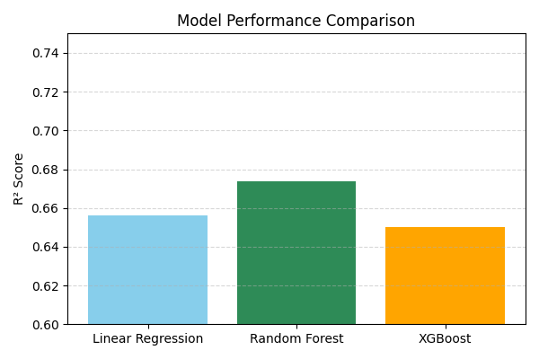
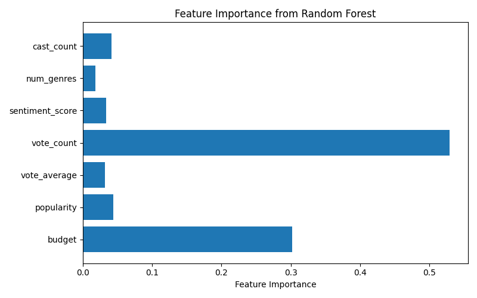

# 🎬 TMDB Movie Success Prediction & Sentiment Analysis

This project analyzes and predicts movie success using data from TMDB (The Movie Database). It combines machine learning and sentiment analysis to estimate box office revenue based on various features like budget, popularity, votes, and viewer sentiment.

### 🔗 Live App

Access the interactive Streamlit app here:  
👉 [tmdb-movie-success-analysis Streamlit App](https://tmdb-movie-success-analysis-3mnpyzhjdqnc3v29shhsvd.streamlit.app/)

---
## 📁 Project Structure
```bash
TMDB-MOVIE-SUCCESS-ANALYSIS/
│
├── Dataset/ # CSV data (original & processed)
├── models/ # Trained model (.pkl)
├── outputs/ # Visualizations
│
├── .gitignore
├── requirements.txt
├── README.md
│
├── 1_data_preprocessing.py # Data loading, cleaning, and feature extraction
├── 2_sentiment_analysis.py # VADER sentiment scoring on overviews
├── 3_regression_model.py # Linear regression model
├── 4_visualizations.py # Genre-wise sentiment plot
├── 5_random_forest_model.py # Random Forest model
├── 6_model_comparison_chart.py # R² comparison chart
├── 7_advanced_tmdb_analysis.py # GridSearchCV, XGBoost, clustering
├── 8_app_streamlit.py # Streamlit interface
```
---

---

## 📊 Key Features

- ✅ Predicts box office **revenue** based on movie features
- 💬 Analyzes **sentiment** using VADER on movie overviews
- 🔍 Feature importance visualization
- 🤖 Machine Learning Models:
  - Linear Regression
  - Random Forest (tuned with GridSearchCV)
  - XGBoost
- 📈 Model comparison chart (R² scores)
- 🧠 Clustering of movies based on sentiment + success
- 🖥️ **Streamlit UI** for interactive predictions

---

## 🗂 Dataset

- **Source:** [Kaggle - TMDB 5000 Movie Dataset](https://www.kaggle.com/datasets/tmdb/tmdb-movie-metadata)
- Contains metadata on over 5000 movies: budget, revenue, genre, cast, overview, etc.

---

## 📷 Screenshots

<p float="left">
  
  
</p>

---

## 🚀 Run the App Locally

# Clone this repository
```bash
git clone https://github.com/your-username/tmdb-movie-success-analysis.git
cd tmdb-movie-success-analysis
```
# Set up virtual environment (optional but recommended)
```bash
python3 -m venv venv
source venv/bin/activate
```

# Install required libraries
pip install -r requirements.txt

# Run the Streamlit app
streamlit run app_streamlit.py

---

# 🌐 Deploy on Streamlit Cloud

1. Push this project to GitHub

2. Go to Streamlit Cloud

3. Click “New App” and select your GitHub repo

4. Set 8_app_streamlit.py as the main file

5. Done! Your app is live 🚀 — share the link 🎉

# 👩‍💻 Author
Eashita Suvarna
(Creative Tech Explorer)
📬 LinkedIn - www.linkedin.com/in/eashita-s-851819251